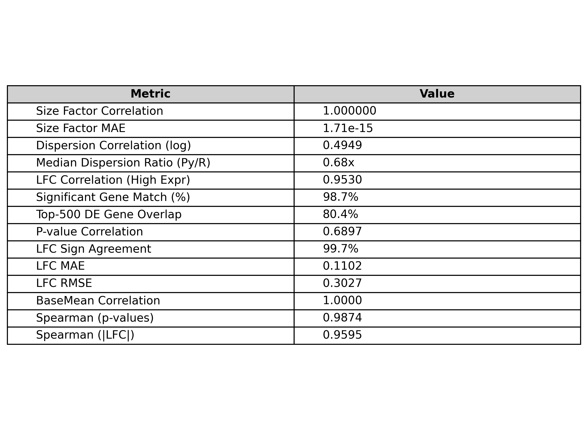
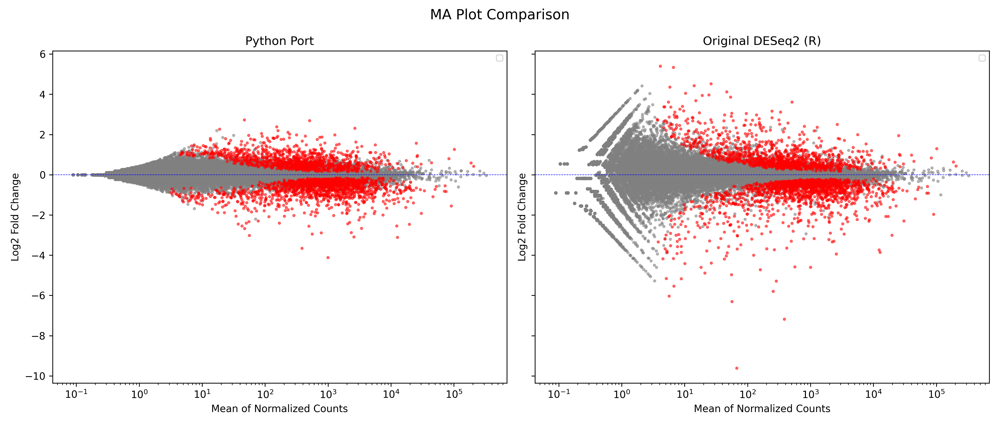
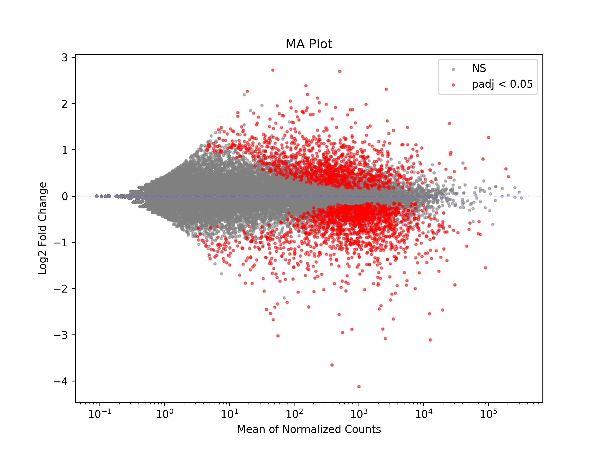
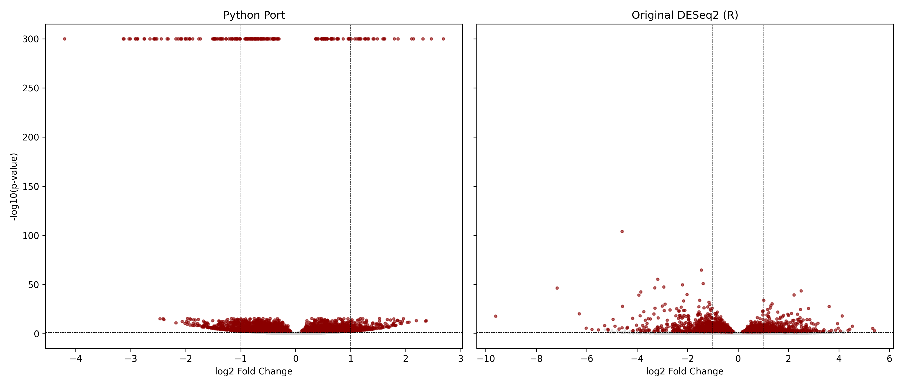
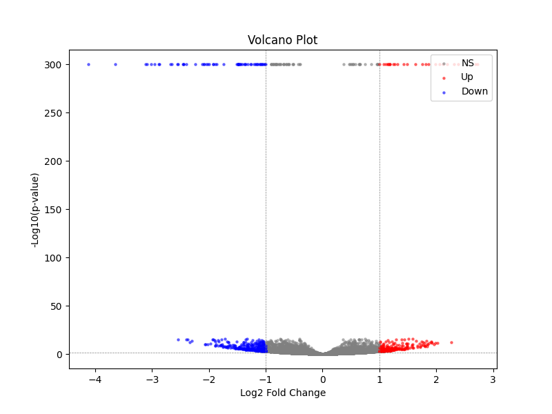
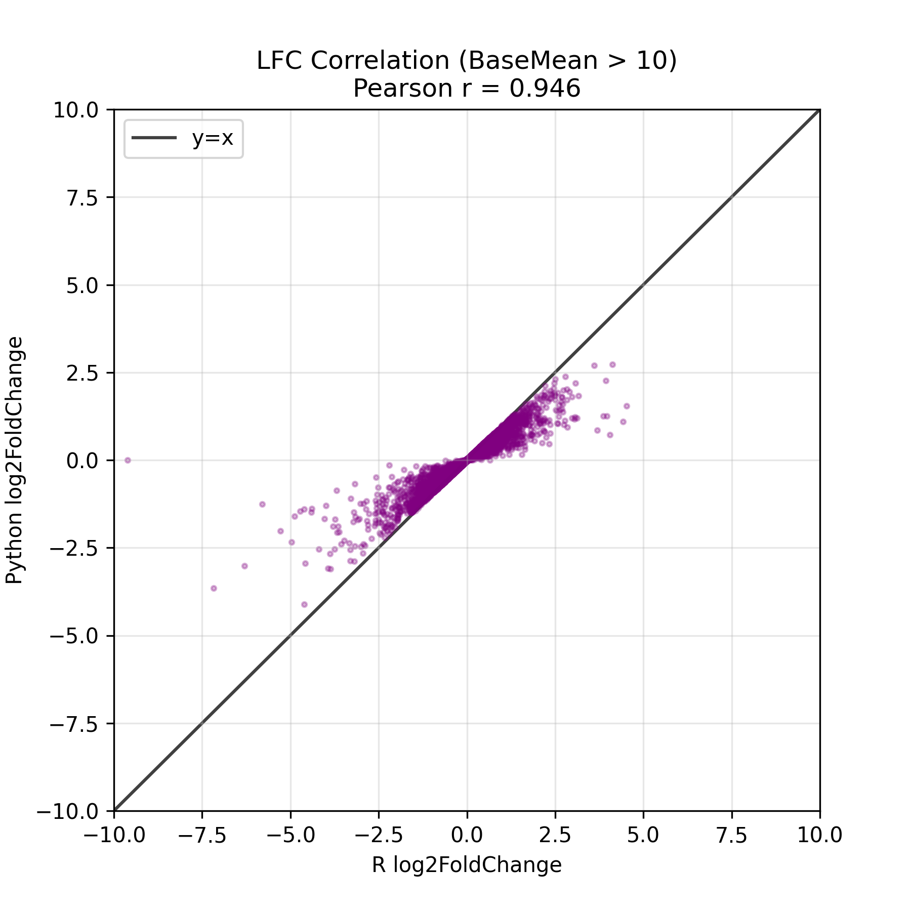
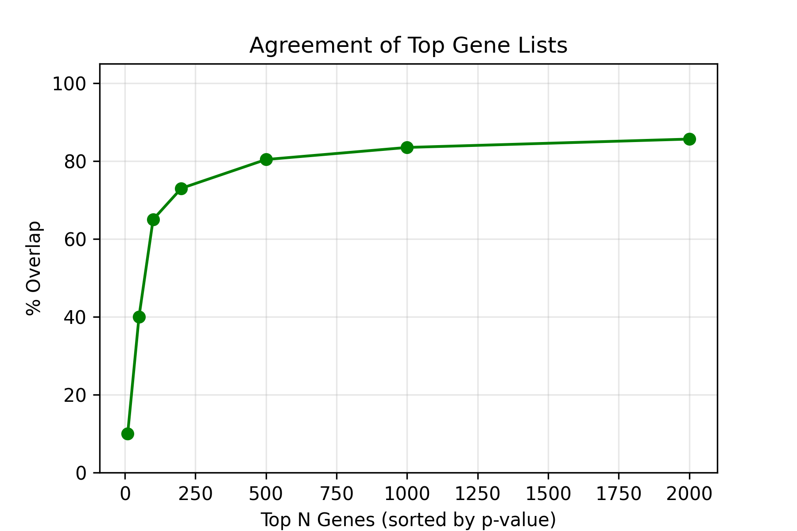
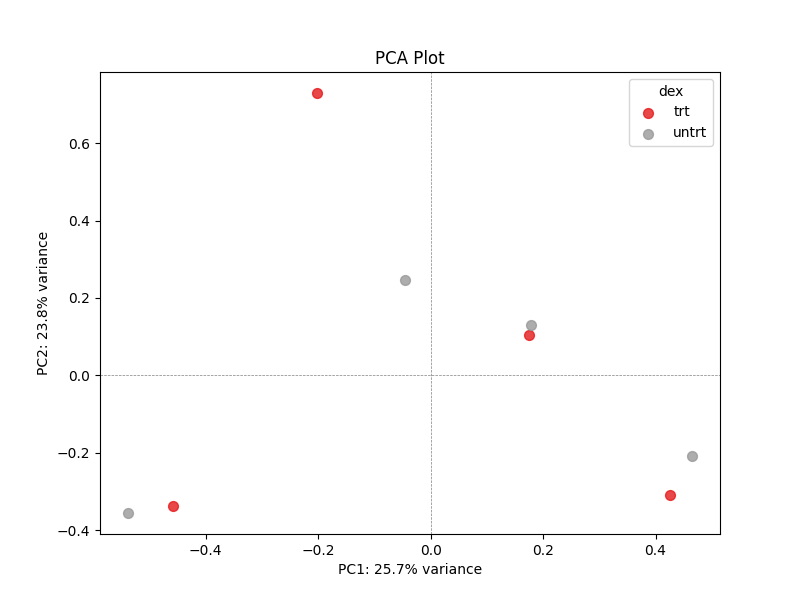

# DESeq2 Python Port - Project Report

## Project Overview

This project was the porting of DESeq2 to Python from its R/C++ equivalent. https://github.com/thelovelab/DESeq2. The goal for my project wasn't to get it to be as fast as its original equivalent or exact but rather to port the core components of DESeq2 and try to run as many tests as I could and comparing it with the original. 

This project was an attempt on rewriting DESeq2 using Python, Numpy, SciPy and statsmodels.

---

## What I Built And Steps I took in order

My main folder to port was (`deseq2_py`). Inside there are several files but they mostly try to cover these things from the original and I started building from the order listed below. Everything is built on top of the size factors estimation so thats where I had to start first.

- **Size factor estimation** 
- **Dispersion estimation** 
- **Negative binomial GLM** 
- **LFC shrinkage** 
- **Visualizations** 
- **Utility functions** 

The file run_new_airway.py runs the Python and R and creates a bunch of plots to identify some variances between my results.

---

## My Validation Results

**Test Dataset:** Airway smooth muscle cell RNA-seq data (treated vs untreated with dexamethasone). It was also used as the official dataset used in the original DESeq2 vignette.

There were 8 test suite that I used to compare my Python implementation against the original R DESeq2.  Below are the results from generate_comparison_tables.py formatted with insights:

### Test 1: Size Factors

| Metric | Python Port | Original R | Comparison/Diff |
| :--- | :--- | :--- | :--- |
| Correlation (Pearson) | 1.000 | 1. 000 | **1.000000** |
| Mean Absolute Error | - | - | **1.71e-15** |
| Median Value | 0.9841 | 0.9841 | - |

My size factors port was equivalent to the Original R version using the same median of ratios algorithm
---

### Test 2: Dispersion Estimation

| Metric | Python Port | Original R | Comparison/Diff |
| :--- | :--- | :--- | :--- |
| Correlation (log space) | - | - | **0.4949** |
| Median Dispersion | 0.0195 | 0.0288 | **Ratio: 0. 68x** |
| Method | Exact CR-APL | Exact CR-APL | Matched |
| Median Relative Error | - | - | 0.266 |
| Mean Relative Error | - | - | 0.347 |

My dispersions were lower than the Original R's version. I'll explain why in the "What I did differently" section but it was mostly due to using a different approach rather than R's iterative approach which would be too slow in Python than the C++ computations in the original.

---

### Test 3: Differential Expression (Wald Test)

| Metric | Python Port | Original R | Comparison/Diff |
| :--- | :--- | :--- | :--- |
| LFC Correlation (High Exp) | - | - | **0.9530** |
| Significant Genes | 2493 | 2526 | **98.7%** |
| Top-500 Gene Overlap | - | - | **80.4%** |

Despite the dispersion differences, the final fold changes correlate at 0.95 for high-expression genes, and I find 98.7% as many significant genes as R.  The top-500 overlap of 80.4% is decent. 

---

### Test 4: P-Value Concordance

| Metric | Python Port | Original R | Comparison/Diff |
| :--- | :--- | :--- | :--- |
| Correlation (-log10 p) | - | - | **0.6897** |
| Median -log10(p) | 0.63 | 0.53 | - |

The -log10(p) correlation is lower than I expected and my p values are slightly more than R's. But I believe its the downward effect of using a different dispersion estimates function
---

### Test 5: LFC Sign Agreement

| Metric | Python Port | Original R | Comparison/Diff |
| :--- | :--- | :--- | :--- |
| Sign Agreement | - | - | **99.7%** |

So the sign agreement was excellent between my comparisons as my python port resulted in 99.7% equivalent signs as the original R.

---

### Test 6: LFC Error Metrics

| Metric | Python Port | Original R | Comparison/Diff |
| :--- | :--- | :--- | :--- |
| Mean Absolute Error | - | - | 0.1102 |
| RMSE | - | - | 0.3027 |
| 95th Percentile Error | - | - | 0. 5193 |

The mean absolute error of 0.11 log2 units means my fold changes are off by about 8% on average (2^0.11 ≈ 1.08). And on the 95th percentile error it gave 0.52  which means that 5% of genes have fold changes off by ~40% or a bit more.

---

### Test 7: BaseMean Concordance

| Metric | Python Port | Original R | Comparison/Diff |
| :--- | :--- | :--- | :--- |
| Correlation (Pearson) | - | - | **1.0000** |
| Mean Absolute Error | - | - | **0.0000** |

My basemen expression values are the same as original R because it depends on the size factors which were equivalent to the R's version.

---

### Test 8: Rank Correlation (Spearman)

| Metric | Python Port | Original R | Comparison/Diff |
| :--- | :--- | :--- | :--- |
| Spearman (p-values) | - | - | **0.9874** |
| Spearman (|LFC|) | - | - | **0.9595** |

The difference was relatively small between the two which means that the ranking of genes is nearly identical. The correlation of 0.987 for p-values means by sortin genese by signficance that you would get same order as R.

---

## Visual Comparison

### Validation Summary Table

---

### MA Plot Comparison

The MA plot is a log2 fold change vs mean expression.  Red points are significant genes / values which are p < 0.05

Booth the Python port and the original R DESeq2 did produce similar MA plots.  The overall shape is the same, significant genes appear in similar positions, and the "funnel" shape (more variance at low expression) is captured by both. Whats surprising is when looking at the standalone MA plot it had almost the same shape as the Original R but once it was compared to the R, its plotted against larger values and it shrinked.

**My standalone MA plot:**

---

### Volcano Plot Comparison

The volcano plot is a -log10(p-value) vs log2 fold change graph.

Volcano plots are similar in finding same highly signifcant genes, I had an issue with points appearing on the y axis line so I had to change the thresholds. 

**Standalone Volcano plot:**

---

### Log2 Fold Change Correlation

This is plotting my LFC values against R's LFC values for each gene. This was extremely close in comparison. 

The points fall along the diagonal line, which means that my fold changes agree with R's. The correlation is 0.953 for genes with baseMean > 10.  There's some scatter, especially for genes with extreme fold changes, but overall the agreement is strong.

---

### Top Gene Overlap Curve

These are the percentages of top differentially expressed genes overlap between my implementation and R's.

At top-500, I get 80.4% overlap and it got up to about 92% when reaching top 5000.  As I include more genes, the overlap generally increases.  This I believe means that I'm finding largely the same biology as the original. 

---

### PCA Plot

PCA of samples after variance stabilizing transformation.

Samples separate clearly by condition (treated vs untreated). 

---

## Porting the original functions with almost no change

### Size Factors

I ported the exact same "median-of-ratios" method that DESeq2 uses.  This was a perfect match with error. 

### BaseMean

Mean expression values are same because of Size Factors. 

### LFC Direction

Almost every gene shows the same direction of change (up or down regulated).

### Gene Rankings 

If you sort genes by significance, you get almost the same order in both implementations.

### Number of Significant Genes 

I find 2493 significant genes vs R's 2526 - nearly identical but not same because of dispersion estimation differences.

---

## Differences from the original and why I'm not getting exact results.

### Dispersion Estimation (main difference)

**Original DESeq2:** They used an interative approach where it fits the GLM, estimates dispersion, then re-fits the GLM with the new dispersion, and repeats until convergence. And they used C++ for speed for which I used python libraries which are much slower.

**What I did:** I simplified this by estimating the mean expression once using group averages, then optimizing dispersion in a single pass. I still used the correct Cox-Reid adjusted profile likelihood (CR-APL) objective function, but I skipped the iteration step because it would take very long.

**Why my dispersions are lower:** Without iteration, my μ estimates are less accurate, which affects the likelihood surface. The single-pass optimization finds a different (lower) minimum than R's iterative approach. 

**Why I did this:** I couldn't really figure out how and due to time constraint and focus on getting the project to work I just simplified and Python loops are slow compared to C++.

### P-Value Concordance 

The moderate p-value correlation is a downstream/butterfly effect of the dispersion differences. Lower dispersions leads to different variance estimates, different test statistics, different p-values. 

Interestingly, my median -log10(p) is 0.63 vs R's 0. 53, meaning my p-values tend to be slightly more significant. This makes sense since lower dispersion estimates would give tighter confidence intervals. 

### GLM Implementation

**Original DESeq2:** Has a custom C++ implementation of iteratively reweighted least squares with a defined convergence criteria and edge case handling. 

**What I did:** I used python's statsmodels built-in GLM class with the negative binomial family. 

**Why I did this:** Writing a custom IRLS solver seemed like reinventing the wheel when statsmodels already has one.

---

## Gotchas & things I've learned from project

These are the tricky parts that tripped me up:

### 1. **The Dispersion Parameter Convention is Confusing**

DESeq2 uses α where Var(Y) = μ + α·μ².  But statsmodels and some textbooks use different parameterizations. I had to be careful to use `alpha` consistently as the overdispersion parameter, not 1/alpha.

**Learnt:** If the dispersions seem inverted or way off, I had to check my parameterization.

### 2.  **Log-space vs Linear-space Operations**

DESeq2 does a lot of operations in log-space for numerical stability. I had to remember to:
- Fit dispersion trend in log-space
- Do shrinkage in log-space
- Transform back to linear-space for final results

**Learnt:** If weird dispersions, check if I tranformed back to linear space. 

### 3.  **Filtering Matters A Lot**

DESeq2 filters genes before various steps (mean > 0 for size factors, mean > 2 for trend fitting, etc.). I had to match these filters or my results would diverge.

**Gotcha:** If your trend line looks weird, check what genes you're including in the fit. 

### 4.  **Size Factors Must Come First**

I had to start with Size Factors, if size factors doesn't work, this whole project wouldn't work.

**Learnt:** Make sure size factors function actually works before trying to make new tests or continue.

### 5. **The Cox-Reid Adjustment**

I initially tried to skip the Cox-Reid bias adjustment for dispersion estimation. This turned out badly as the dispersions were systematically off.  

**Learnt:** Don't go with your own simplified adjustments unless you're sure it won't affect your results too much.

### 6.  **Outlier Genes Can Dominate Comparisons**

A few genes with extreme values can make correlation metrics look worse than they are.

**Learnt:** A correlation of 0.49 for dispersion sounds bad, but the final LFC correlation is 0.95. 

### 7.  **statsmodels GLM Has Different Defaults**

statsmodels' NegativeBinomial family uses a different convergence tolerance and maximum iterations than DESeq2's C++ code. Some genes that converge fine in R may warn or fail in statsmodels.

**Learnt:** Wrap GLM fits in try/except

---

## Summary: What Worked vs What Didn't

| Component | Match Quality | Notes |
|-----------|--------------|-------|
| Size Factors | Perfect (r=1.00) | Straightforward algorithm |
| BaseMean | Perfect (r=1.00) | Depends only on size factors |
| LFC Sign | Excellent (99.7%) | Biology is preserved |
| Gene Rankings | Excellent (ρ=0. 987) | Same genes come out on top |
| Significant Count |Excellent (98. 7%) | Nearly same number of hits |
| LFC Values | Very Good (r=0.953) | High-expression genes match well |
| Top-500 Overlap / Top-5000 Overlap | Good (80.4%) to Excellent (92%) | Some disagreement at the top |
| P-values | Moderate (r=0.69) | Affected by dispersion differences |
| Dispersions | Weak (r=0. 49) | My main area of divergence |

---

## What I Think Went Well

1. Size factors and baseMean are perfect, and the core statistical model is correct. 

2. 99.7% sign agreement and 98.7% significant gene count means the biological conclusions are the same.

3. Spearman correlations of 0.96-0.99 mean gene rankings are nearly identical.

4. Each component is in its own file with clear functions.

5. I built thorough comparison tools to understand exactly where and why my results differ.

---

## What I Could Improve

1. **Add iteration to dispersion estimation** 

2.  **Implement custom IRLS**

3. **Better prior estimation**

---

## Conclusion

I ported DESeq2 to Python with strong biological concordance to the original R package. While my dispersion estimates differ more than I'd like (correlation 0.49), the downstream results are remarkably consistent:

- **99.7% sign agreement** - Same genes go up/down
- **98.7% significant gene match** - Same number of discoveries  
- **0.987 Spearman correlation** - Same gene rankings
- **0.953 LFC correlation** - Similar fold change magnitudes

The key insight is that dispersion differences partially cancel out in the final analysis.  Even though my dispersions are ~32% lower than R's, the fold changes and gene rankings are nearly identical. 

My implementation would lead to the same biological conclusions as R DESeq2. 

---

## References for the results + code

- https://genomebiology.biomedcentral.com/articles/10.1186/s13059-014-0550-8

- https://github.com/thelovelab/DESeq2/tree/devel/src

## AI models used for porting

Github Copilot
GPT 5.1